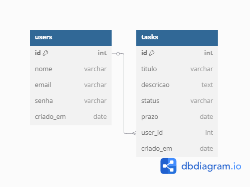
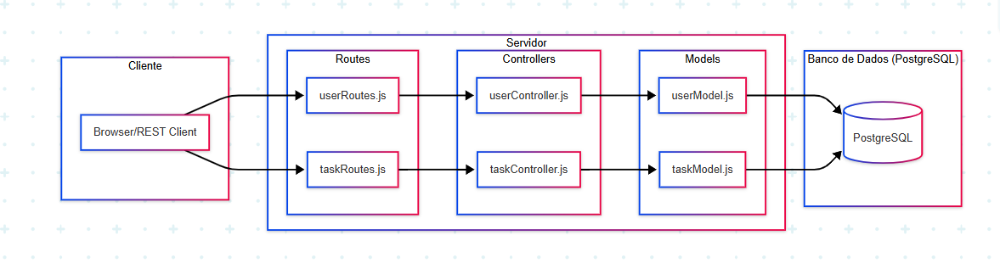
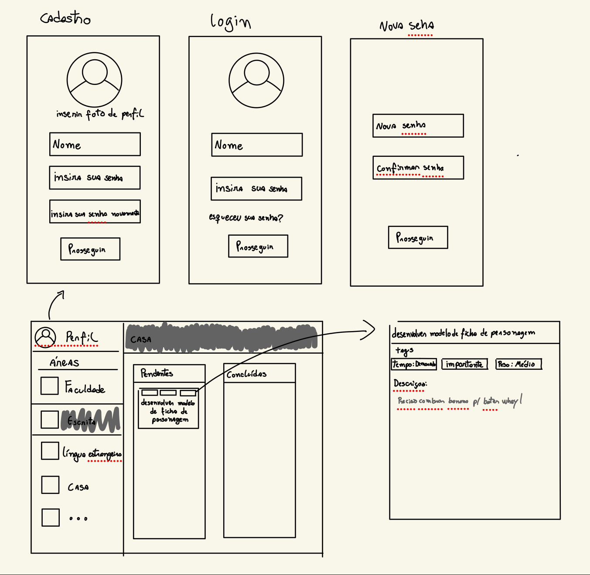
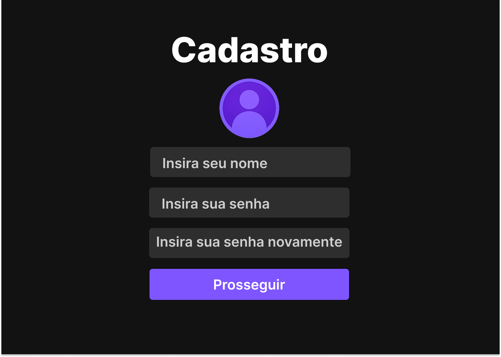
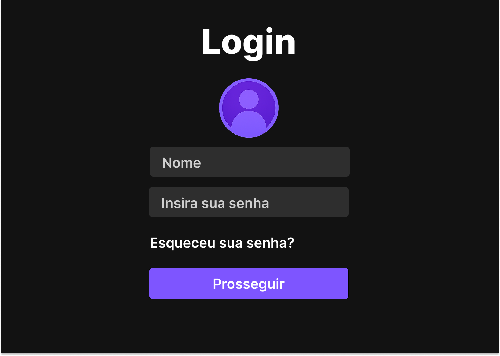
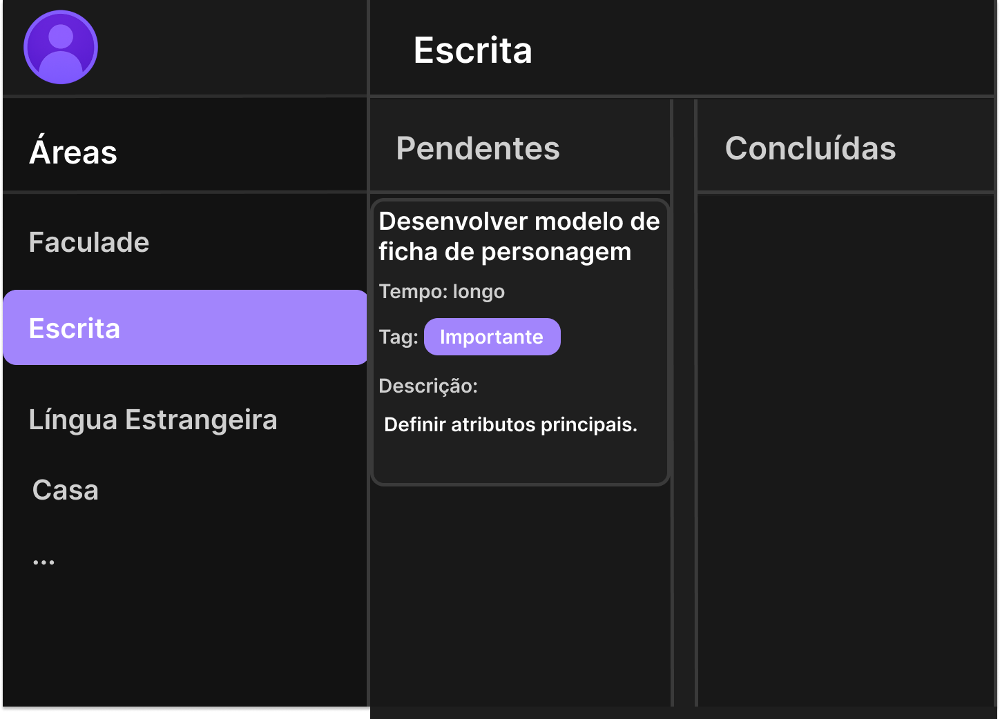

# Web Application Document - Projeto Individual - Módulo 2 - Inteli


## Sistema de organização de tarefas.


#### Desenvolvedor: Paulo Victor Batista De Souza
---

## <a name="c1"></a>1. Introdução (Semana 01)

&emsp;Este projeto consiste no desenvolvimento de um sistema web de gerenciamento de tarefas, com foco na simplicidade, usabilidade e eficiência. O objetivo é fornecer uma solução leve para organização de atividades, destinada a usuários que precisam acompanhar prazos, compromissos e fluxos de trabalho — como estudantes, escritores e profissionais autônomos. O sistema permite o cadastro, edição, exclusão e visualização de tarefas, com estrutura otimizada para facilitar o controle individual de atividades diárias. A aplicação prioriza uma interface intuitiva e funcional, garantindo acessibilidade e rapidez nas interações.


---


## <a name="c2"></a>2. Visão Geral da Aplicação Web


### 2.1. Personas (Semana 01)


***Lara Croft**, 22 anos, estudante universitária e escritora iniciante.  
Se sente sobrecarregada com os prazos e precisa de uma ferramenta digital para se organizar..*

<div align="center">
<sub>Figura 1 - Persona- Projeto individual </sub>

<sup>Fonte: Aluno Paulo Victor.</sup>
</div>


### 2.2. User Stories (Semana 01)


- **US01**: Como escritora, quero adicionar tarefas com prazo para não perder entregas.
- **US02**: Como estudante, quero ver uma lista organizada de tarefas para entender minhas obrigações.
- **US03**: Quero marcar tarefas como concluídas para acompanhar meu progresso.

#### Análise da US01 (INVEST)
- Independente: A funcionalidade de adicionar tarefas pode ser feita separadamente das outras funcionalidades.
- Negociável: O formato do cadastro pode ser ajustado conforme o necessário.
- Valiosa: Ajuda o usuário a organizar suas atividades e cumprir prazos.
- Estimável: É possível prever o tempo necessário para o desenvolvimento.
- Pequena: A ação de adicionar uma tarefa é simples e de pequena escala.
- Testável: Podemos testar criando uma tarefa e verificando se ela aparece corretamente no sistema.


---


## <a name="c3"></a>3. Projeto da Aplicação Web


### 3.1. Modelagem do banco de dados  (Semana 3)
<div align="center">
<sub>Figura 2 - Modelo relacional do banco de dados - Projeto individual</sub>

<sup>Fonte: Aluno Paulo Victor</sup>
</div>


---
&emsp; A imagem acima apresenta o diagrama relacional do banco de dados do siatema de organização de tarefas. O modelo é composto por  entidades principais: Usuarios e tarefas.


---


### Modelo físico (arquivo .sql)


``` -- ---
-- Globals
-- ---

-- SET SQL_MODE="NO_AUTO_VALUE_ON_ZERO";
-- SET FOREIGN_KEY_CHECKS=0;

-- ---
-- Table 'Users'
-- 
-- ---

DROP TABLE IF EXISTS `Users`;
		
CREATE TABLE `Users` (
  `id` INTEGER NULL AUTO_INCREMENT DEFAULT NULL,
  `Nome` VARCHAR NULL DEFAULT NULL,
  `Email` VARCHAR NULL DEFAULT NULL,
  `Senha` VARCHAR NULL DEFAULT NULL,
  `Criado_em` VARCHAR NULL DEFAULT NULL,
  PRIMARY KEY (`id`)
);

-- ---
-- Table 'Tasks'
-- 
-- ---

DROP TABLE IF EXISTS `Tasks`;
		
CREATE TABLE `Tasks` (
  `id` INTEGER NULL AUTO_INCREMENT DEFAULT NULL,
  `Título` VARCHAR NULL DEFAULT NULL,
  `Descrição` VARCHAR NULL DEFAULT NULL,
  `Status` VARCHAR NULL DEFAULT NULL,
  `Prazo` VARCHAR NULL DEFAULT NULL,
  `User_id` VARCHAR NULL DEFAULT NULL,
  `Criado_em` VARCHAR NULL DEFAULT NULL,
  PRIMARY KEY (`id`)
);

-- ---
-- Foreign Keys 
-- ---

ALTER TABLE `Tasks` ADD FOREIGN KEY (User_id) REFERENCES `Users` (`id`);

-- ---
-- Table Properties
-- ---

-- ALTER TABLE `Users` ENGINE=InnoDB DEFAULT CHARSET=utf8 COLLATE=utf8_bin;
-- ALTER TABLE `Tasks` ENGINE=InnoDB DEFAULT CHARSET=utf8 COLLATE=utf8_bin;

-- ---
-- Test Data
-- ---

-- INSERT INTO `Users` (`id`,`Nome`,`Email`,`Senha`,`Criado_em`) VALUES
-- ('','','','','');
-- INSERT INTO `Tasks` (`id`,`Título`,`Descrição`,`Status`,`Prazo`,`User_id`,`Criado_em`) VALUES
-- ('','','','','','','');
```


---


### 3.1.1 BD e Models (Semana 5)
### 3.1.1 BD e Models (Semana 5)

A estrutura do banco de dados foi definida manualmente utilizando SQL, sem o uso de ORMs, respeitando a arquitetura MVC. Os Models foram implementados na camada de serviços e são responsáveis por realizar operações de leitura e escrita no banco de dados PostgreSQL.

#### Estrutura do Banco de Dados

O sistema possui duas entidades principais: `users` e `tasks`. Abaixo está a descrição de cada uma:

**Tabela `users`**
- `id` (PK): Identificador único do usuário.
- `nome`: Nome do usuário.
- `email`: Email de login.
- `senha`: Senha criptografada do usuário.
- `criado_em`: Data de criação do usuário.

**Tabela `tasks`**
- `id` (PK): Identificador único da tarefa.
- `titulo`: Título da tarefa.
- `descricao`: Descrição da tarefa.
- `status`: Estado da tarefa (ex: pendente, concluída).
- `prazo`: Data limite para conclusão.
- `user_id` (FK): Relacionamento com a tabela `users`.
- `criado_em`: Data de criação da tarefa.

O relacionamento entre as tabelas é de **1 para N**, onde um usuário pode possuir várias tarefas.

#### Implementação dos Models

Os Models estão localizados na pasta `/models` e encapsulam as funções de acesso ao banco de dados via comandos SQL, utilizando o módulo `pg`.

**`userModel.js`**
- `getAll()`: Retorna todos os usuários.
- `getById(id)`: Retorna um usuário pelo ID.
- `create(data)`: Cria um novo usuário com os campos `nome`, `email` e `senha`.
- `update(id, data)`: Atualiza nome, email e senha de um usuário existente.
- `delete(id)`: Remove um usuário da base de dados.

**`taskModel.js`**
- `getAll()`: Retorna todas as tarefas.
- `getById(id)`: Retorna uma tarefa específica.
- `create(data)`: Cria uma nova tarefa com título, descrição, status, prazo e user_id.
- `update(id, data)`: Atualiza os dados de uma tarefa existente.
- `delete(id)`: Remove uma tarefa da base de dados.

Essa abordagem direta ao banco permite maior controle das queries, além de facilitar a manutenção em ambientes acadêmicos ou de prototipagem.

> A modelagem relacional utilizada está disponível no item **3.5.1 Modelo Relacional**.


### 3.2. Arquitetura (Semana 5)

A arquitetura da aplicação foi construída com base no padrão **MVC (Model-View-Controller)**, que garante uma melhor separação de responsabilidades e facilita a manutenção e escalabilidade do sistema.

O modelo **MVC** divide a aplicação em três camadas principais:

- **Model:** Responsável por lidar com os dados e com o banco de dados. Nesta aplicação, os models estão definidos na pasta `models/`, onde temos os arquivos `userModel.js` e `taskModel.js`. Eles realizam as operações de leitura, inserção, atualização e exclusão no banco de dados PostgreSQL.

- **View:** A camada de visualização pode ser tanto um cliente externo (como um navegador consumindo a API via REST) quanto páginas renderizadas no backend. Neste projeto, a comunicação se dá majoritariamente por meio da Web API que retorna dados em JSON para um possível frontend.

- **Controller:** Responsável pela lógica da aplicação. Recebe as requisições HTTP, processa os dados com o auxílio dos models e retorna a resposta adequada. Os controllers estão localizados na pasta `controllers/`, com `userController.js` e `taskController.js` definindo as regras para suas respectivas rotas.

As rotas estão organizadas em arquivos separados dentro da pasta `routes/`, com `userRoutes.js` e `taskRoutes.js` responsáveis por expor os endpoints da API para usuários e tarefas, respectivamente.

Abaixo, segue o diagrama ilustrando essa arquitetura:

<div align="center">
  
</div>

> Figura 1 - Diagrama da Arquitetura MVC da aplicação. Fonte: Aluno Paulo Victor.


### 3.3. Wireframes (Semana 03)


<div align="center">
<sub>Figura 3 - Wireframe- Projeto individual</sub>

<sup>Fonte: Aluno Paulo Victor</sup>
</div>

---
### Relação entre Wireframes e User Stories
Os wireframes apresentados foram projetados para atender diretamente às User Stories definidas na Semana 01, levando em consideração as dores e necessidades da persona Lara Croft, uma estudante universitária e escritora iniciante.

- **US01:** Como escritora, quero adicionar tarefas com prazo para não perder entregas.

Representada pela tela de detalhamento da tarefa, que possui campos para adicionar título, tags, nível de importância e uma descrição detalhada. Isso permite que o usuário registre tarefas com todas as informações relevantes para gerenciar seus prazos.

- **US02:** Como estudante, quero ver uma lista organizada de tarefas para entender minhas obrigações.

Atendida pela tela principal (dashboard), onde as tarefas estão divididas em colunas (Pendentes, Concluídas) e organizadas por área (como “Faculdade”, “Casa”). O menu lateral também permite filtrar tarefas por categoria.

- **US03:** Quero marcar tarefas como concluídas para acompanhar meu progresso.

A interface da tela inicial possui uma coluna exclusiva para tarefas concluídas, o que permite ao usuário visualizar facilmente o que já foi feito. Isso favorece o acompanhamento do progresso de forma clara e direta.

Essas telas foram desenhadas com base nas prioridades da persona, como praticidade, clareza e foco em organização pessoal.

---
### 3.4. Guia de estilos (Semana 05)

Este mini guia de estilos apresenta os principais padrões visuais utilizados na construção do sistema. O objetivo foi criar uma experiência simples, prática e coerente com as necessidades da persona Lara Croft, com foco em clareza, contraste e organização de tarefas.

---

#### **Layout Geral**
- Estrutura em colunas (painel lateral + dashboard de tarefas)
- Cards com cantos levemente arredondados (`border-radius: 10px`)
- Espaçamento entre elementos: 12px a 24px
- Linhas divisórias sutis em cinza escuro (`#3A3A3A`)

---

#### **Tipografia**
- **Fonte:** Inter (Google Fonts)
- **Cores utilizadas:**
  - Texto principal: branco `#FFFFFF`
  - Texto secundário: `#CFCFCF`
- **Tamanhos principais:**
  - Títulos (ex: “Cadastro”, “Login”): `32px`, negrito
  - Textos em campos e cards: `16px`
  - Descrições e detalhes: `14px`

---

#### **Paleta de Cores**
| Elemento                          | Cor        | Hex      |
|----------------------------------|------------|----------|
| Fundo principal                  | Cinza escuro | `#1E1E1E` |
| Fundo de cards                   | Cinza médio escuro | `#3A3A3A` |
| Inputs (caixas de texto)         | Cinza carvão | `#2E2E2E` |
| Texto secundário                 | Cinza claro | `#CFCFCF` |
| Texto principal                  | Branco       | `#FFFFFF` |
| Botões (fundo)                   | Roxo vibrante | `#7E55FF` |
| Tags e elementos de destaque     | Roxo claro | `#A285FC` |
| Coluna ativa                     | Cinza mais claro | `#1E8E8E8` |
| Bordas e linhas divisórias       | Cinza escuro | `#3A3A3A` |

---

#### **Botões**
- Cor de fundo: `#7E55FF`
- Texto: branco (`#FFFFFF`)
- Tamanho padrão: altura `40px`
- Formato: cantos arredondados (6px)
- Estilo: preenchido, sem borda
- Estados alternativos (hover/focus): não implementados nesta fase

---

#### **Assets**
- Ícone de perfil utilizado em telas de login e dashboard:

<div align="center">

</div>

- Estilo do ícone:  
  - Círculo roxo claro (`#A285FC`) com gradiente sutil  
  - Silhueta centralizada em tom mais claro para garantir contraste

---

As cores, espaçamentos e tipografia foram pensados para maximizar contraste e legibilidade, respeitando uma paleta escura moderna e confortável para longos períodos de uso.


### 3.5. Protótipo de Alta Fidelidade (Semana 05)

A seguir estão as principais telas do protótipo de alta fidelidade desenvolvido com base nas user stories de Lara Croft, estudante universitária e escritora iniciante. O sistema é um gerenciador de tarefas com foco em praticidade e clareza para a organização de prazos e ideias.

Você pode acessar o protótipo completo clicando [neste link para o Figma](https://www.figma.com/design/J9XW0bJF5q8hgsPazID2Al/Sem-t%C3%ADtulo?node-id=0-1&t=3QYMSxzdeiKhNLMc-1).

---

#### Figura 1 – Tela de Cadastro
Tela destinada à criação de nova conta, contendo campos de nome e senha com estilo visual padronizado.



---

#### Figura 2 – Tela de Login
Interface de entrada para usuários recorrentes, com acesso ao sistema e link para recuperação de senha.



---

#### Figura 3 – Tela de Redefinição de Senha
Permite ao usuário redefinir a senha ao digitar e confirmar um novo código de acesso.


---

#### Figura 4 – Dashboard Kanban
Tela principal do sistema, composta por um painel de áreas personalizáveis (como "Faculdade" ou "Casa") e colunas do tipo Kanban (Pendentes e Concluídas). Cada tarefa pode conter tags, prazo, prioridade e uma breve descrição.




### 3.6. WebAPI e Endpoints (Semana 05)

A Web API do projeto foi estruturada para seguir o padrão REST, com endpoints dedicados à criação, leitura, atualização e exclusão de dados. Abaixo estão descritos os principais endpoints da aplicação, divididos por responsabilidade, com base nas rotas definidas nos arquivos `userRoutes.js` e `taskRoutes.js`.

---

#### Tipos de Solicitação

| Método  | Ação                                     |
|---------|------------------------------------------|
| **GET**    | Buscar informações (listar ou exibir dados) |
| **POST**   | Criar um novo recurso (registro)         |
| **PUT**    | Atualizar um recurso existente           |
| **DELETE** | Remover um recurso                       |

---

#### Gerenciamento de Usuários

| Método | Rota         | Finalidade                                 |
|--------|--------------|---------------------------------------------|
| GET    | `/users`     | Retorna todos os usuários cadastrados       |
| GET    | `/users/:id` | Retorna os dados de um usuário específico   |
| POST   | `/users`     | Cria um novo usuário                        |
| PUT    | `/users/:id` | Atualiza os dados de um usuário             |
| DELETE | `/users/:id` | Remove um usuário do sistema                |

---

#### Gerenciamento de Tarefas

| Método | Rota         | Finalidade                                         |
|--------|--------------|-----------------------------------------------------|
| GET    | `/tasks`     | Retorna todas as tarefas registradas               |
| GET    | `/tasks/:id` | Retorna os dados de uma tarefa específica          |
| POST   | `/tasks`     | Cria uma nova tarefa (com prazo, descrição, etc.)  |
| PUT    | `/tasks/:id` | Atualiza uma tarefa existente                      |
| DELETE | `/tasks/:id` | Remove uma tarefa do sistema                       |

---

#### Correspondência com as User Stories

| User Story | Finalidade                                                        | Endpoint relacionado     |
|------------|-------------------------------------------------------------------|---------------------------|
| **US01**   | Adicionar tarefas com prazo para não perder entregas              | `POST /tasks`             |
| **US02**   | Ver uma lista organizada de tarefas para entender obrigações      | `GET /tasks`              |
| **US03**   | Marcar tarefas como concluídas para acompanhar o progresso        | `PUT /tasks/:id`          |

---

#### Observações

- Todos os endpoints foram desenvolvidos utilizando **Express.js**.
- A estrutura segue o padrão **MVC** e os controllers fazem a ponte entre os endpoints e os dados armazenados no banco **PostgreSQL**.
- As respostas da API são retornadas em formato **JSON**, facilitando a integração com um frontend ou cliente REST como Postman.


### 3.7 Interface e Navegação (Semana 07)


*Descreva e ilustre aqui o desenvolvimento do frontend do sistema web, explicando brevemente o que foi entregue em termos de código e sistema. Utilize prints de tela para ilustrar.*


---


## <a name="c4"></a>4. Desenvolvimento da Aplicação Web (Semana 8)


### 4.1 Demonstração do Sistema Web (Semana 8)


*VIDEO: Insira o link do vídeo demonstrativo nesta seção*
*Descreva e ilustre aqui o desenvolvimento do sistema web completo, explicando brevemente o que foi entregue em termos de código e sistema. Utilize prints de tela para ilustrar.*


### 4.2 Conclusões e Trabalhos Futuros (Semana 8)


*Indique pontos fortes e pontos a melhorar de maneira geral.*
*Relacione também quaisquer outras ideias que você tenha para melhorias futuras.*


## <a name="c5"></a>5. Referências


_Incluir as principais referências de seu projeto, para que seu parceiro possa consultar caso ele se interessar em aprofundar. Um exemplo de referência de livro e de site:_<br>


---
---


